# Aqara S1E 智能妙控开关 - 60 FPS 自研原生 GUI 固件与 Home Assistant 增强系统

本项目是专为 **Aqara 妙控开关 S1E (SSD202D 芯片架构)** 打造的**纯原生 C 语言高性能 GUI 渲染引擎**与 **Home Assistant 双向深度联动系统**。

彻底摆脱官方封闭界面的限制，提供媲美原生手机级动画体验的 60 FPS 满帧流体界面、**全功能屏幕首页 UI 所见即所得编辑画布**、Web 可视化管理后台、双向锁屏 DIY 传感器与 Emoji 自定义、全量硬件传感器与电量计量自动暴露、丰富自定义弹窗通知、PIN 安全锁以及原生 Linux 终端。

---

## 📸 实机运行效果预览

### 1. 核心交互与待机锁屏
| 60 FPS 满帧卡片主页 | 下拉流体控制中心 | 微光时钟与传感器锁屏 |
| :---: | :---: | :---: |
| 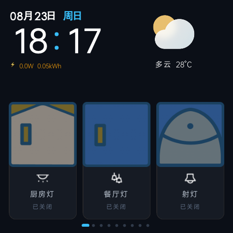 | 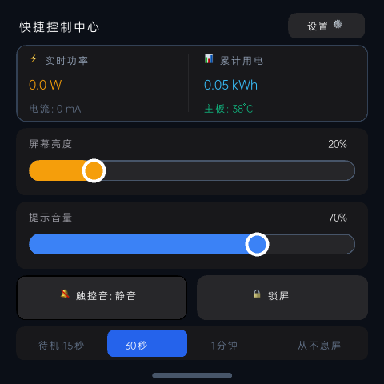 | 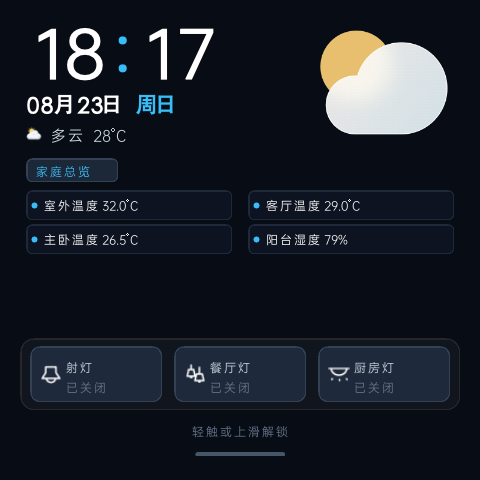 |

### 2. 丰富通知与安防联动系统
| 全屏门铃监控大图弹窗 | 顶部悬浮毛玻璃通知横幅 | 下拉通知中心 (50条历史/滑动清除) |
| :---: | :---: | :---: |
| 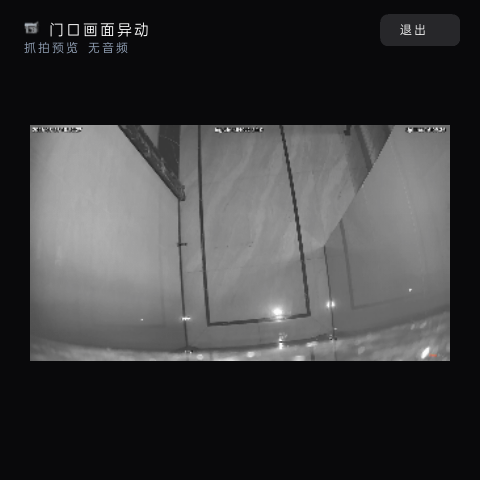 | 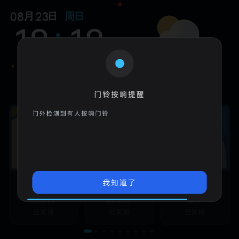 | 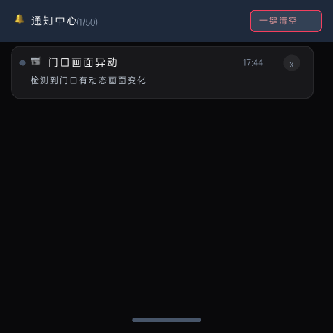 |

### 3. Home Assistant 设备导航与实体管理
| 区域 Chips 筛选导航页 | 4096 实体大容量网格添加 | 拼音键盘实时搜索实体 | 卡片顺序微调与管理 |
| :---: | :---: | :---: | :---: |
| 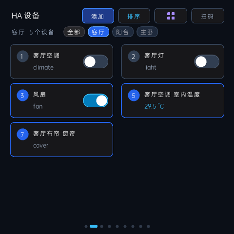 | 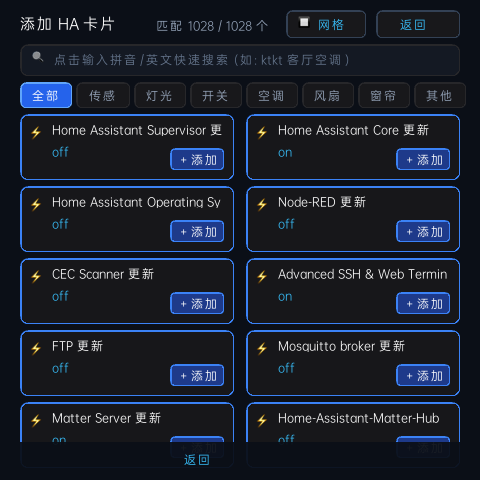 | 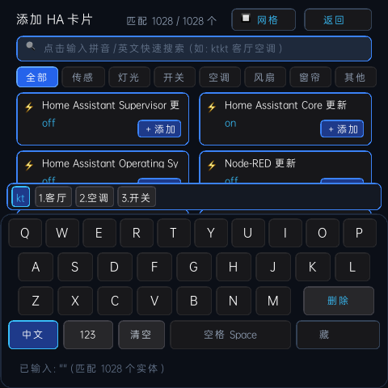 | 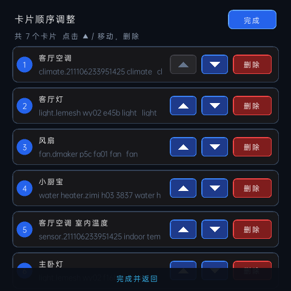 |

### 4. 全品类专属智能卡片 (实机交互)
| 空调温控卡片 (环形温度) | 调光灯与色温双滑块卡片 (左暖右冷) | 窗帘开合可视化卡片 | 风扇多档位调速卡片 |
| :---: | :---: | :---: | :---: |
| 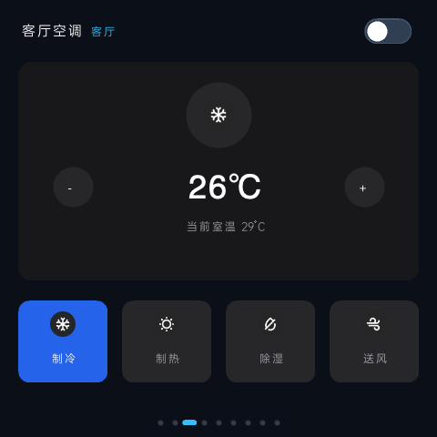 | 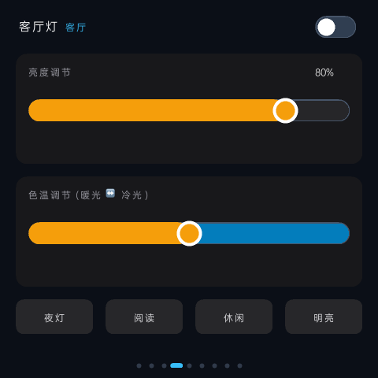 | 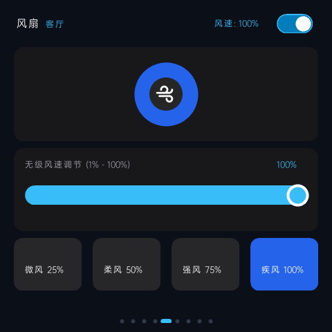 | 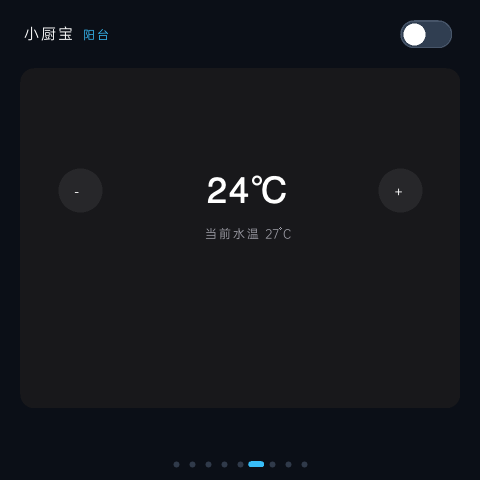 |

### 5. 首页 UI 画布与锁屏 DIY 编辑器
| 设置主页 2 列网格 | 首页 UI 所见即所得编辑画布 | 一键切换预设宫格布局 | 锁屏 DIY 传感器与文案编辑 |
| :---: | :---: | :---: | :---: |
| 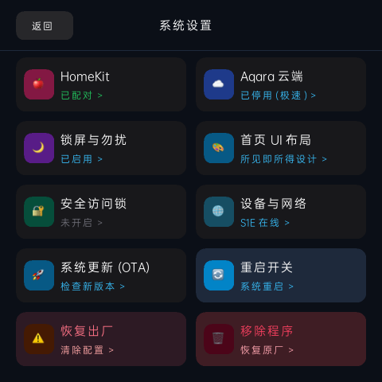 |  | 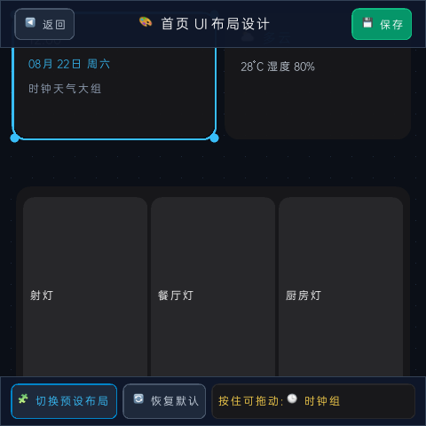 | 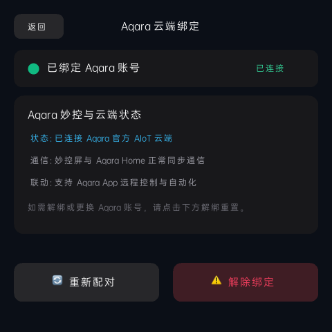 |

### 6. 安全管控、原生终端与 Web SPA 控制台
| 4 位 PIN 密码安全锁 | 屏幕原生 Linux 终端 | Web 现代化管理后台 |
| :---: | :---: | :---: |
| 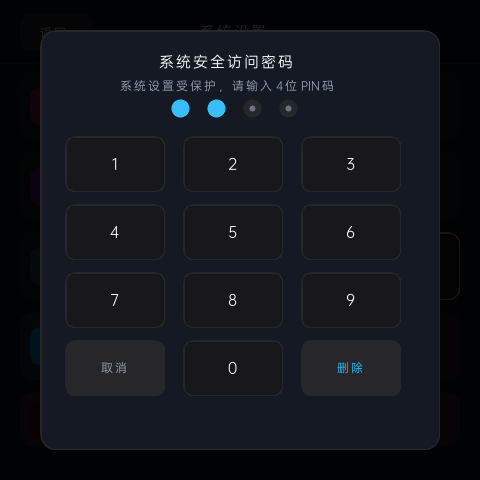 | 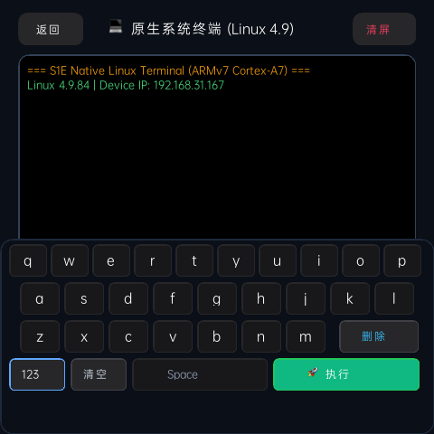 | 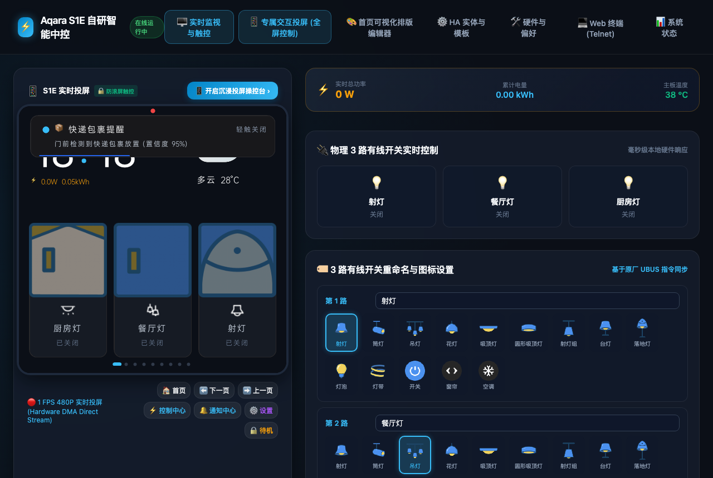 |

---

## 🌟 核心特性

- 🔤 **全量 7,445 汉字 GB2312 中文字库引擎 (Full Standard Chinese Typography)**：全量覆盖 GB2312 全部 87 区 × 94 位的 7,445 个汉字及符号（包括“固件”的“件”、“服务”的“服”、“清楚”的“楚”等全部常用字符），二分查找高效检索，中文字符 100% 满血渲染。
- 📱 **设置网格独立解耦与原生终端诊断 (Decoupled Settings & Shell Terminal)**：主设置菜单采用清晰统一的 2 列 5 行独立网格，彻底分离【🚀 系统更新 (OTA)】与【💻 终端诊断 (Shell)】，告别入口冲突与触控误触发；支持快捷指令栏与全功能虚拟键盘。
- 🍏 **Apple HomeKit 局域网永续在线与本地 IPC 中枢 (HomeKit ADK & Local IPC Broker)**：深度保留 S1E 官方本地事件中枢（），维持  本地 SEQPACKET 消息队列；**100% 完整保留 Apple HomeKit 局域网 ADK 服务群（、、）**，iOS 家庭 App 永久在线、6个无线按键与3路开关双向极速响应；本地 Home Assistant 毫秒级控制不受任何影响。
- 🔄 **安全出厂重置与恢复官方原厂系统 (Safe Factory Reset & Restore Official Aqara)**：无论在 S1E 屏幕还是 Web 管理后台，均支持一键清除配置重置系统，或一键彻底卸载自研程序并安全回退到原厂官方 ，附带详尽的数据丢失风险警示弹窗。
- 🎨 **Web 控制台与触屏端所见即所得布局设计器 (Multi-touch Visual Layout Editor)**：Web 端全面统一桌面鼠标与移动端/平板触屏交互，支持触控拖拽移动、双向微调手柄、44px 防误触热区与触屏 D-Pad 步进器；配合 S1E 屏幕端原生编辑器，随时随地自由排版。
- 📶 **屏幕端 Wi-Fi 实时搜索与触控软键盘连接 (Wi-Fi Manager & Soft Keyboard)**：支持直接在 S1E 屏幕【设置】 $
ightarrow$ 【Wi-Fi 网络搜索】中一键扫描周边 Wi-Fi，支持完整 UTF-8 中文 SSID 解码显示与信号强度实时刷新；内置 QWERTY 全键盘、数字/符号切换、密码明暗文切换与连击回退，轻松在屏幕上输密连接新网络。
- 🛡️ **极致内存瘦身与内核级 OOM 免疫机制 (RAM Optimization & OOM Immunity)**：重构底层内存模型，合并全屏浮层离屏缓冲区并紧凑化 LRU 全景缓存，系统常驻内存净减 **~5.5 MB**；自动注入 `oom_score_adj=-1000` 保护等级，杜绝极限负载下的 UI 闪退；同时重构 Web 投屏为 `/dev/fb0` 显存零拷贝直读。
- 🚀 **在线系统更新与一键 OTA 升级 (GitHub Releases OTA)**：支持直接在 S1E 屏幕【设置】 $
ightarrow$ 【系统更新】或 Web 后台一键检测 GitHub 发布的最新固件，自动进行流式下载、实时动态进度条显示、校验解压与平滑热重启，无需手动重新刷机。
- ☁️ **绿米官方云服务精准停用与 HomeKit 局域网永续在线 (Lumi Cloud & HomeKit Isolation)**：精准停用绿米公网上报服务（`ha_agent`），彻底消除后台 FUSE 文件系统与公网轮询唤醒；**100% 完整保留 Apple HomeKit 局域网 ADK 服务群（`ha_master`、`ha_basis`、`ha_driven`）**，iOS 家庭 App 永久在线、6个无线按键与3路开关双向极速响应；本地 Home Assistant 毫秒级控制不受任何影响。
- 📹 **480px 边缘撑满摄像头监控与 4MB 抓拍相册 (Full-Width Camera & Snapshot Quota)**：摄像头实时流与门铃抓拍支持 480px 全屏边缘撑满显示，彻底消除两侧黑边；抓拍缓存配额扩展至 4MB，安全保留 50+ 张 480×270 高清抓拍，占 tmpfs 内存不足 16%，画质与内存双重保障。
- 🔄 **三端开关顺序全链路一致性同步 (3-Way Switches Order Sync)**：首页卡片、锁屏微光胶囊开关（含触控映射）与 Web SPA 控制台完全统一遵循 `layout_p0.json` 的 `order` 顺序，毫秒级响应，开机自动持久化恢复。
- 🎨 **屏幕首页 UI 所见即所得编辑 (WYSIWYG Layout Editor)**：无需借助电脑，直接在 S1E 屏幕【设置】 $\rightarrow$ 【首页 UI 布局】中进入交互式画布，实时拖拽组件位置、点击切换高亮选区，一键循环切换 **经典 2+2 宫格**、**大时钟 1+2 宫格**、**大开关模式**与**极简全景**等预设，点击保存即刻全屏满帧生效！
- 🏷️ **导航页房间/区域快速筛选 (Area Chips Filter)**：导航页自动汇总并提取所有已绑定设备的房间区域（客厅、主卧、阳台等），在数量文字右侧以横向滑动 Chips 展示，支持阻尼滑动与一键按区域精准过滤设备列表。
- 💡 **标准通用色温控制架构 (Universal Kelvin Architecture)**：全面采用 Home Assistant 官方标准 `color_temp_kelvin` 接口，无缝适应所有品牌调光调色灯具（Hue、Yeelight、Aqara、米家、Zigbee、Tuya、Matter 等）；滑块与 4 大快捷场景（夜灯 3000K、阅读 4000K、休闲 5000K、明亮 6500K）严格遵循「左暖 ↔ 右冷」黄金操作习惯。
- 🔍 **海量实体无上限搜索 (4096 Entities Capacity)**：基于 Linux 页延迟分配技术，支持秒级拉取与搜索超 4000+ 个 HA 智能家居实体，满足超大户型与复杂设备联动需求，内存零浪费。
- ⚡ **Home Assistant 原生免配置双向控制 (Native WebSocket Engine)**：**零额外插件、零配置 YAML**！S1E 自动建立原生 WebSocket 双向长连接，0.01 秒捕获 HA 网页/App 点击，0.3 秒即时双向同步，内置 20 秒心跳保活与毫秒级断线自愈。
- 🔔 **下拉通知中心 (Notification Center)**：左上角下拉唤出通知中心，支持查看最多 50 条历史通知、天蓝色阻尼微光滚动条、右上角一键清空与单个卡片滑动删除。
- 🌙 **智能勿扰模式 (DND Mode)**：支持自定义夜间勿扰时段与全天勿扰，勿扰期间全面静音触控音与普通通知，**仅紧急安防通知（Urgent Alarms）声光穿透报警**。
- ⚡ **极致性能 (60 FPS 满帧渲染)**：基于 Framebuffer 硬件 DMA 双缓冲与脏矩形技术，CPU 稳态占用仅 **2.2%**，守护进程常驻内存仅 **1.2 MB**，滑动极其丝滑。
- 🔔 **丰富自定义弹窗通知 (Custom Notifications)**：支持通过 HA 或 Web API 随时向 S1E 屏幕推送带半透明毛玻璃背景、图标、提示音与倒计时的弹窗通知，支持联动门铃实时监控视频流。
- ⚡ **全量硬件传感器与电量计量自动暴露**：实时功率 (W)、累计电量 (kWh)、电网电压 (V)、设备序列号 (DID)、型号、固件版本、运行内存、Wi-Fi 信号强度等全量自动发布到 Home Assistant（支持直接接入 HA 能源看板）。
- 🤖 **Home Assistant 实体自动注册与双向同步**：开机自动向 HA 注册 S1E 屏幕电源、3路继电器、亮度、音量、触控音、IP、当前显示屏及实时 Camera 监控画面。
- 🌐 **全量 API 暴露至 Home Assistant**：支持在 HA 中通过自动化调用 S1E 唤醒屏幕、锁屏、推送自定义弹窗通知、临时覆盖锁屏文案、切换页面及模拟触控。
- 🎨 **全量 Apple Color Emoji 支持 (1,322+ 字符)**：自研 20×20 Indexed 调色板 + Deflate 压缩技术，仅占用 **802 KB** Flash 与 **100 KB** RAM 缓存池。
- 📱 **锁屏文案与传感器 DIY (所见即所得)**：支持在屏幕或 Web 端自由编辑最多 8 行微光信息，集成内置中文拼音输入法与全量 Emoji。
- 🔒 **PIN 密码安全锁 (默认密码: `1234`)**：4位访问密码保护，防止误触或未授权操作，支持设置页访问管控与终端门禁。
- 📟 **原生 Linux 终端 (Terminal)**：S1E 屏幕直接输入 Shell 命令并查看实时输出（IP、内存、进程、网络诊断）。

---

## 📋 安装总览

整个流程分为两步：
1. **开启 S1E 的 Telnet 权限**（通过 UART 串口连接并在 U-Boot 中清除 root 密码，刷入支持 telnetd 的基础固件）。
2. **在 Telnet 中一键安装本自研 GUI 运行包**。

---

## 🛠️ 第一部分：硬件接线与开启 Telnet

> [!NOTE]
> 拆机串口接线与 Telnet 固件修改方案来自社区先驱 [@niceboygithub](https://github.com/niceboygithub) 的开源项目 [AqaraSmartSwitchS1E](https://github.com/niceboygithub/AqaraSmartSwitchS1E)，在此致以诚挚的感谢！

> [!WARNING]
> 拆机与焊接串口操作存在一定风险，请确保具备基本动手能力并严格按照指引操作。

### 1. 拆开外壳并连接 UART 串口
- 拆开 S1E 面板后盖，主板串口引脚定义如下图所示：

<p align="center">
  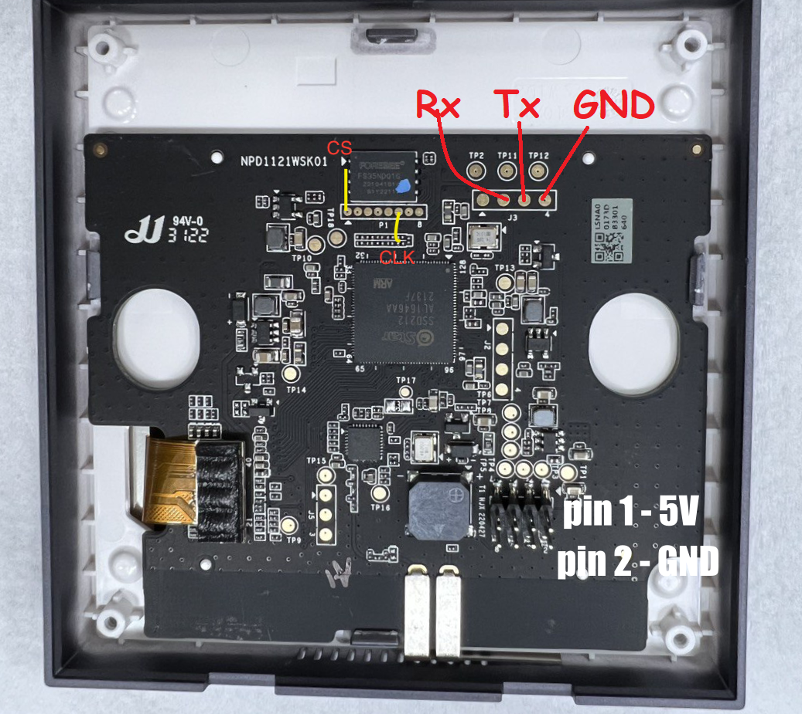
</p>

- 使用 USB 转 TTL 串口模块（波特率设置为 `115200`）连接电脑：
  - `GND` $\leftrightarrow$ `GND`
  - `TX`  $\leftrightarrow$ `RX`
  - `RX`  $\leftrightarrow$ `TX`

### 2. 中断 U-Boot 引导
- 电脑打开 PuTTY / SecureCRT / minicom，波特率 `115200`。
- 上电开机瞬间，在串口终端中连续快速按下 `Enter`（回车键）中断启动，进入 `SigmaStar #` 命令行提示符。
  > *注：部分 2023 年 7 月后出厂的批次若回车无法中断，可在开机读取内核瞬间短接 CLK (Pin 6) 与 GND，或 CS (Pin 1) 与 Vcc 触发中断。*

### 3. 修改引导参数绕过密码并挂载文件系统
在 U-Boot 中依次输入：

```bash
nand info
printenv bootargs
```

将 `bootargs` 中的 `init=/linuxrc` 临时替换为 `init=/bin/sh`：

```bash
setenv bootargs root=/dev/mtdblock7 rootfstype=squashfs ro init=/bin/sh loglevel=8 LX_MEM=0x3FE0000 mma_heap=mma_heap_name0,miu=0,sz=0x2B0000 cma=2M highres=on mmap_reserved=fb,miu=0,sz=0x300000,max_start_off=0x3300000,max_end_off=0x3600000 mtdparts=nand0:1664k@0x140000(BOOT0),1664k(BOOT1),256k(ENV),256k(ENV1),128k(KEY_CUST),3m(KERNEL),3m(KERNEL_BAK),20m(rootfs),20m(rootfs_bak),1m(factory),1m(MISC),10m(RES),10m(RES_BAK),-(UBI)
run bootcmd
```

系统将直接进入单用户只读 Shell。此时执行挂载与密码清除命令：

```bash
/bin/fwfs --block_size=131072 --subblock_size=32768 --block_cycles=500 --read_size=2048 --prog_size=2048 --cache_size=32768 --file_cache_size=32768 --cache_pool_size=2 --block_count=8 --lookahead_size=8 /dev/mtd10 /misc
rm /misc/passwd
reboot -f
```

重启完成后，在普通 Shell 中执行密码清空：

```bash
passwd -d root
```

### 4. 刷入支持 Telnetd 的修改版基础固件
官方 2.0.6 之后移除了 `telnetd`，通过串口执行以下指令刷入由 niceboygithub 制作的支持后台守护与 `post_init.sh` 的修改版基础固件：

```bash
cd /tmp && wget -O /tmp/curl "http://master.dl.sourceforge.net/project/aqarahub/binutils/curl?viasf=1" && chmod a+x /tmp/curl
/tmp/curl -s -k -L -o /tmp/s1e_update.sh https://raw.githubusercontent.com/niceboygithub/AqaraSmartSwitchS1E/master/firmwares/modified/S1E/s1e_update.sh
chmod a+x /tmp/s1e_update.sh && /tmp/s1e_update.sh
```

固件刷写完成并重启后，S1E 将常驻开启 **Telnet 23 端口**。

---

## 🚀 第二部分：Telnet 一键极速安装自研 GUI

确保 S1E 已连接 Wi-Fi 局域网。电脑终端直接 Telnet 登录 S1E：

```bash
telnet <S1E_IP_ADDRESS>
```
*(账号 `root`，无密码直接回车)*

在 Telnet 终端中**直接复制并粘贴执行以下单行安装指令**（自动准备 HTTPS 工具，**多镜像节点并发竞速，毫秒级自动选择最快可用源**）：

```bash
cd /tmp && ([ -x /tmp/curl ] || [ -x /data/scripts/curl ] || wget -O /tmp/curl "http://master.dl.sourceforge.net/project/aqarahub/binutils/curl?viasf=1") && chmod a+x /tmp/curl /data/scripts/curl 2>/dev/null && CURL=$(command -v /tmp/curl || command -v /data/scripts/curl || echo "curl") && rm -f /tmp/install.sh /tmp/inst_ok /tmp/i_*.sh && IDX=0 && for u in "https://ghfast.top/https://raw.githubusercontent.com/oopuuu/AqaraS1E-Custom-GUI/main/install.sh" "https://cdn.jsdelivr.net/gh/oopuuu/AqaraS1E-Custom-GUI@latest/install.sh" "https://ghproxy.net/https://raw.githubusercontent.com/oopuuu/AqaraS1E-Custom-GUI/main/install.sh" "https://raw.githubusercontent.com/oopuuu/AqaraS1E-Custom-GUI/main/install.sh"; do IDX=$((IDX+1)); ( $CURL -s -k -L --connect-timeout 4 -m 15 "$u" -o "/tmp/i_${IDX}.sh" 2>/dev/null && [ -s "/tmp/i_${IDX}.sh" ] && [ ! -f /tmp/inst_ok ] && touch /tmp/inst_ok && mv -f "/tmp/i_${IDX}.sh" /tmp/install.sh ) & done && for i in $(seq 1 30); do [ -f /tmp/inst_ok ] && break; sleep 0.2; done && ([ -s /tmp/install.sh ] || wait) && rm -f /tmp/i_*.sh && [ -s /tmp/install.sh ] && sh /tmp/install.sh
```

> [!TIP]
> **多节点并发竞速机制**：该指令同时向 `ghfast.top`、`cdn.jsdelivr.net`、`ghproxy.net` 与 GitHub 官方源发起低时延探测下载，毫秒级自动采纳最先完成的安装脚本，彻底避免因单一源受限或 DNS 污染导致的安装失败。

安装脚本将全自动执行：
1. 自动备份原设备已有的 HA 与锁屏配置；
2. 下载并解压最新版纯运行包至 `/data/scripts/`；
3. 将 `curl` 工具持久化保存至 `/data/scripts/curl` 方便后续使用；
4. 赋予全部程序执行权限并立即拉起 `s1e_standalone_app` 渲染引擎与 `ha_daemon` 同步守护进程；
5. 启动 Web 8080 控制台。

> [!NOTE]
> 安装完成无需重启，屏幕将立即点亮并切换为全新的 60FPS 极速界面！

---

## 🎨 第三部分：屏幕首页 UI 布局所见即所得编辑器使用

进入屏幕【设置】 $\rightarrow$ 点击 **【🎨 首页 UI 布局】**，即可进入原生交互式设计画布：

1. **选中与拖拽**：
   - 点击屏幕中的组件（时钟大组件、天气组件、3路继电器开关卡片）即可高亮选中，组件周围会出现**发光青色边框与角点手柄**；
   - 在选中的组件上按住并滑动，即可在屏幕中自由拖拽移动至任意坐标位置。
2. **预设快速切换**：
   - 点击底部 **【🧩 切换预设布局】** 按钮，可一键循环切换 4 种经典宫格布局：
     - **预设 1 (经典 2+2 宫格)**：时钟 (280×140) + 天气插画 (148×140) + 3路继电器 (448×244)
     - **预设 2 (大时钟 1+2 宫格)**：全宽横版时钟 (448×140) + 紧凑天气 (214×244) + 3路继电器 (218×244)
     - **预设 3 (大开关模式)**：顶部胶囊时钟与天气 + 下半区大按键开关 (448×280)
     - **预设 4 (极简全景模式)**：大字号时间 + 胶囊天气条 + 底部轻量开关
3. **保存即刻生效**：
   - 点击右上角 **【💾 保存】**，系统将自动写入 `/data/scripts/layout_p0.json`，弹出半透明 Toast 提示，并立即全屏应用至主页，无需重启。

---

## 🔔 第四部分：自定义弹窗通知功能说明 (Custom Notifications)

本自研系统内置了高性能全屏/浮窗通知渲染模块。无论当前处于**主页卡片、控制中心、设置页、还是微光时钟锁屏待机状态**，一旦接收到通知，S1E 会立即自动点亮屏幕并弹出具有**高斯模糊透明毛玻璃质感**的通知卡片，同时伴随系统提示音。

### 1. 通知样式与特性

- 🎨 **毛玻璃半透明浮窗 (Toast)**：悬浮于屏幕上方，展示标题、详细文字、对应图标与倒计时进度条，倒计时结束后平滑向上收起。
- 🔔 **内置丰富图标库**：`bell`（门铃）、`door`（门窗）、`water`（水浸漏水）、`fire`（烟雾火警）、`shield`（安防警戒）、`light`（照明）、`info` / `warning`。
- 📹 **摄像头联动 (实时画面)**：支持传入 `stream_url`（如门铃按下时，直接在 S1E 屏幕浮窗中弹出门口摄像头的实时画面）。
- ⏱️ **自动息屏与恢复**：通知结束后，若处于待机时段会自动平滑返回待机微光时钟。

---

### 2. 在 Home Assistant 中发送通知 (自动化实战示例)

通过 Web 管理后台一键导入 YAML 后，您可以在 Home Assistant 自动化中直接使用 `notify.s1e_screen` 服务像向手机推送一样给 S1E 推送通知：

#### 示例 1：门铃按下时，在 S1E 屏幕弹出带提示音的门铃通知
```yaml
alias: "门口有人按门铃 - S1E 屏幕弹窗提醒"
trigger:
  - platform: state
    entity_id: binary_sensor.doorbell_button
    to: "on"
action:
  - service: notify.s1e_screen
    data:
      title: "🔔 访客提醒"
      message: "大门外有人按门铃，请注意查看"
      data:
        icon: "bell"
        style: "toast"
        duration: 8
```

#### 示例 2：厨房水浸传感器报警（高优先级警告）
```yaml
alias: "厨房漏水警报 - S1E 紧急通知"
trigger:
  - platform: state
    entity_id: binary_sensor.kitchen_water_leak
    to: "on"
action:
  - service: notify.s1e_screen
    data:
      title: "🚨 严重警报"
      message: "检测到厨房发生漏水，请立即检查！"
      data:
        icon: "water"
        style: "toast"
        duration: 15
```

---

### 3. 通过 RESTful API 直接发送通知

第三方脚本或终端可通过 HTTP POST / GET 直接向设备推送：

```bash
# HTTP POST 方式 (支持 JSON Payload)
curl -X POST http://<S1E_IP>:8080/cgi-bin/api.cgi?action=push_notify \
  -H "Content-Type: application/json" \
  -d '{"title": "🚗 充电提醒", "msg": "爱车已充满电 (100%)", "icon": "bell", "style": "toast"}'

# HTTP GET 方式 (简易单行 URL 调用)
curl "http://<S1E_IP>:8080/cgi-bin/api.cgi?action=push_notify&title=洗衣完成&msg=阳台洗衣机已洗涤完毕&icon=bell"
```

---

## 🤖 第五部分：Home Assistant 实体与传感器自动注册列表

当在 Web 控制台填入 HA 地址与令牌后，S1E 的 `ha_daemon` 守护进程会自动向 Home Assistant 注册以下全量实体与传感器：

### 1. 硬件控制与状态实体

| 实体 ID (Entity ID) | 类型 | 友好名称 | 作用说明 |
| :--- | :--- | :--- | :--- |
| `switch.s1e_<mac>_screen` | `switch` | S1E 屏幕电源 | 屏幕亮屏 / 黑屏熄屏状态与远程开关 |
| `switch.s1e_<mac>_relay_1` | `switch` | S1E 射灯 | 第 1 路物理继电器实时开关控制 |
| `switch.s1e_<mac>_relay_2` | `switch` | S1E 餐厅灯 | 第 2 路物理继电器实时开关控制 |
| `switch.s1e_<mac>_relay_3` | `switch` | S1E 厨房灯 | 第 3 路物理继电器实时开关控制 |
| `number.s1e_<mac>_brightness` | `number` | S1E 屏幕亮度 | 屏幕背光无级调节 (5% ~ 100%) |
| `number.s1e_<mac>_volume` | `number` | S1E 提示音量 | 系统音效音量调节 (0% ~ 100%) |
| `switch.s1e_<mac>_touch_sound` | `switch` | S1E 按键触控音 | 触控音效开启 / 静音 |
| `camera.s1e_<mac>_screen_live` | `camera` | S1E 屏幕实时画面 | S1E 屏幕的实时 MJPEG 视频流与快照 |

### 2. 电量计量与设备信息传感器

| 传感器 ID (Sensor ID) | 类型 | 友好名称 | 单位 / 状态 | 特性说明 |
| :--- | :--- | :--- | :--- | :--- |
| `sensor.s1e_<mac>_power` | `sensor` | S1E 实时功率 | `W` | 实时有功功率监控 (`device_class: power`) |
| `sensor.s1e_<mac>_energy` | `sensor` | S1E 累计用电量 | `kWh` | 累计电量统计，**支持接入 HA 能源看板** |
| `sensor.s1e_<mac>_voltage` | `sensor` | S1E 电网电压 | `V` | 实时市电电压监测 (如 226.4V) |
| `sensor.s1e_<mac>_model` | `sensor` | S1E 设备型号 | `Aqara S1E (MS-K01D)` | SigmaStar SSD202D 硬件标识 |
| `sensor.s1e_<mac>_serial_number` | `sensor` | S1E 设备序列号 (DID) | `lumi.switch.k01d_<mac>` | 设备出厂唯一硬件识别码 |
| `sensor.s1e_<mac>_firmware` | `sensor` | S1E GUI 固件版本 | `v2.2.2_0006_60FPS` | 自研 60FPS 极速渲染引擎版本 |
| `sensor.s1e_<mac>_ip` | `sensor` | S1E 设备 IP | 局域网实时 IP 地址 | 设备网络地址 |
| `sensor.s1e_<mac>_page` | `sensor` | S1E 当前显示屏 | 当前屏幕停留的页面序号 (0 ~ 7) | 页面跟踪 |
| `sensor.s1e_<mac>_wifi_signal` | `sensor` | S1E Wi-Fi 信号强度 | `dBm` | 实时无线信号质量 (`device_class: signal_strength`) |
| `sensor.s1e_<mac>_free_memory` | `sensor` | S1E 可用运行内存 | `MB` | 系统物理空闲 RAM 实时监控 |

---

## 🌐 第六部分：Web 控制台使用与功能配置

打开电脑或手机浏览器，访问：
```
http://<S1E_IP_ADDRESS>:8080/
```

### 1. 配置 Home Assistant
1. 进入 Web 控制台的 **【Home Assistant 配置】** 卡片；
2. 输入您的 HA 地址（如 `http://192.168.31.174:8123`）及 **长期访问令牌 (Long-Lived Access Token)**；
3. 点击 **【保存 HA 配置】**，设备将在 1~2 秒内完成实体全量同步与向 HA 自动注册。

### 2. 卡片与布局管理
- **屏幕直接添加**：在 S1E 屏幕上长按或点击添加按钮，即可浏览按分类（灯光/开关/窗帘/风扇/温湿度/自动化）分组的 HA 实体列表，支持中文全键盘快速搜索。
- **Web 可视化排布**：在电脑浏览器中直接拖拽调整 8 屏卡片顺序，点击实体列表旁的 `+` 即可添加。
- **主页 P0 布局**：支持 2+2、1+2 等多宫格布局切换。

### 3. 锁屏与勿扰设置
- 在 Web 控制台或 S1E 屏幕上的 DIY 画布中，可添加最多 8 条锁屏文案，支持直接绑定 HA 传感器实时显示温湿度、电量、功率等；
- 支持设置夜间勿扰时段（DND）自动静音与彻底黑屏。

### 4. 系统安全访问锁 (PIN 码)
- **初始默认密码**：系统默认 4 位 PIN 码为 **`1234`**。
- **密码保护范围**：开启后，进入屏幕设置页、原生 Linux 终端等管理功能时均会弹出 PIN 码验证键盘，输入 `1234` 即可解锁。
- **修改密码**：进入【设置】 $\rightarrow$ 【安全访问锁】，点击【🔑 重新设置4位PIN码】即可自定义新密码。

---

## 📦 运行时产物清单说明 (`release/`)

本仓库发布包 `s1e_custom_gui_latest.tar.gz` 仅包含精简后的 **纯运行时必须产物**（总包约 2.8MB），不包含任何源码或冗余依赖：

| 文件名 | 类型 | 说明 |
| :--- | :--- | :--- |
| `s1e_standalone_app` | 核心 ELF | 60 FPS 满帧硬件 DMA 渲染引擎主程序 (内置首页 UI 所见即所得编辑画布) |
| `ha_daemon` | 守护 ELF | HA 实体状态双向异步同步 & 全量硬件传感器自动注册守护进程 |
| `api.cgi` | Web 后端 | 提供 RESTful API、HA 集成 YAML、自定义通知推送、触控注入与快照流 |
| `snap_fast` | 工具 ELF | 高性能 Framebuffer 原生截图工具 |
| `emojis_compact.bin` | 资产 (802 KB) | 全量 1,322+ Apple Color Emoji 紧凑字库 |
| `font_opposans_12.bin` | 字体点阵 | 全量中文 + 拼音输入法 12px 点阵 |
| `font_opposans_15.bin` | 字体点阵 | 全量中文 15px 高清点阵 |
| `date_system_*.bin` | 字体点阵 | 时间与日期专用点阵 |
| `digits_*.bin` | 字体点阵 | 微光时钟专用高清数字点阵 |
| `index.html` | Web 前端 | 现代化管理后台与实时屏幕串流控制台 |
| `safe_png_recv` | 工具 ELF | 门铃与通知图片流式安全校验接收器 (防超大尺寸溢出) |
| `fetch_https.sh` | 运维脚本 | 极速多镜像 HTTPS/OTA 在线固件下载器 |
| `http_body_strip` | 工具 ELF | 极轻量 HTTP 协议头剥离器 |
| `dump_incident.sh` | 运维脚本 | 异常自愈事故现场黑匣子快照导出脚本 |
| `post_init.sh` | 启动脚本 | 设备开机自启与进程常驻守护脚本 |
| `*.json` | 配置文件 | 布局与实体模板配置 |

---

## ❓ 常见问题 (FAQ)

### Q: 如何在屏幕上直接编辑首页 UI 布局？
**A**: 从屏幕顶部下拉控制中心进入【设置】 $\rightarrow$ 点击 **【🎨 首页 UI 布局】**。在画布中点击组件即可拖拽移动，点击底部【🧩 切换预设布局】可快速在 2+2、1+2 等预设间切换，点击【💾 保存】即可实时全屏生效。

### Q: S1E 的用电量和功率可以在 Home Assistant 的“能源 (Energy)”看板中使用吗？
**A**: 可以。`sensor.s1e_<mac>_energy` 带有 `device_class: energy` 和 `state_class: total_increasing`，您可以直接在 Home Assistant 的【配置】 $\rightarrow$ 【仪表盘】 $\rightarrow$ 【能源】中将其添加为个别设备用电量进行统计。

### Q: 如何在 Home Assistant 自动化中给 S1E 推送通知？
**A**: 在 HA 自动化中直接调用 `notify.s1e_screen` 服务，或者调用 `rest_command.s1e_push_notify`，传入 `title`、`message`、`icon`（如 `bell`、`door`）等参数，S1E 屏幕会立即弹出高斯模糊半透明通知浮窗并伴随提示音。

### Q: 系统默认的 4 位安全访问密码是多少？
**A**: 默认密码为 **`1234`**。您可以在屏幕【设置】 $\rightarrow$ 【安全访问锁】中随时重新设置。

---

## 🙏 致谢与参考 (Credits & Acknowledgments)

- 硬件拆解、串口定义与开启 Telnet 基础固件修改方案来自 **[@niceboygithub](https://github.com/niceboygithub)** 的开源项目：[AqaraSmartSwitchS1E](https://github.com/niceboygithub/AqaraSmartSwitchS1E)，特此致谢！

---

## 📄 开源许可

本项目遵循 MIT 开源许可证。
